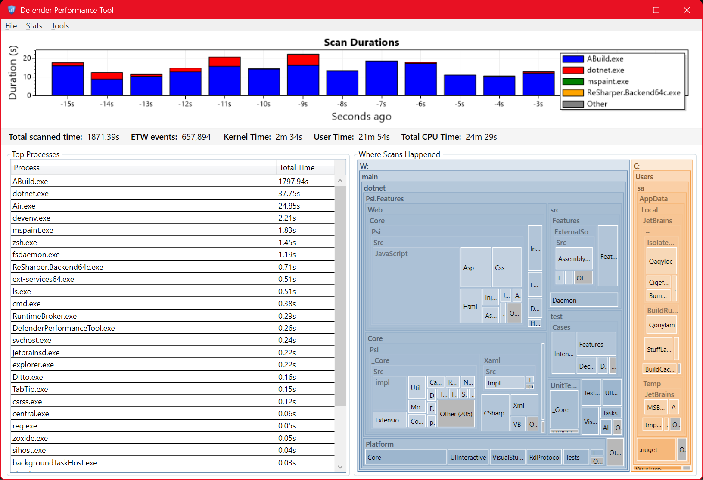

# Windows Defender Performance Tool

A .NET application that monitors Microsoft Defender ETW events and visualizes
scan durations in real-time using a stacked bar chart. Can also visualize
snapshots recorded offline with the
[`New-MpPerformanceRecording`](https://learn.microsoft.com/en-us/powershell/module/defenderperformance/new-mpperformancerecording?view=windowsserver2025-ps)
PowerShell cmdlet.

You can find more information about investigating Microsoft Defender performance, in [their documentation here](https://learn.microsoft.com/defender-endpoint/tune-performance-defender-antivirus).

## Features

- Listens to `Microsoft-Antimalware-Engine/StreamScanRequestTask/Stop` ETW events
- Displays scan durations per process in a stacked bar chart
- Interactive treemap of where scan time went
- Exclusion manager
- Drag and drop snapshots onto the window to analyze the dropped items, or open them via the
  "Open ETL Recording…" button
- CSV export when more than one snapshot is dragged to the window

## Lightweight CPU-time TUI

A companion console program (`WindowsDefenderPerformanceTool_Light_CpuTimeOnly_TUI`) tracks only CPU time (using GetProcessTimes) consumed by
`MsMpEng.exe` (Defender’s antimalware service) and renders a small bar chart of recent activity. It does **not** require elevation — CPU times are read
via `NtQuerySystemInformation`, which is available to non-admin users.

> [!Note]
> Unlike the ETW approach which reports wall time, this gives pure consumed CPU time — which can be lower than wall time if the OS scheduler preempts the Defender thread in between.

However, CPU time is useful for estimating how much compute is allocated for scanning. Optimizing it might help you go toward loading your tool faster. But it cannot tell you which process is being scanned or what files Defender is inspecting — for that, you need the ETW logs.

In practice, we've noticed that total scan wall time roughly equals CPU time when only a few processes are doing intense work (like during an IDE startup). This doesn’t hold for busier scenarios like building a project.

## Measuring Microsoft Defender impact

For more reliable results, perform each measurement after restarting the machine. Microsoft Defender appears to use
internal in-memory caches, so repeated measurements without restarting may not show the real impact.

## About scan duration

Microsoft Defender emits ETW start and stop events per scan operation. The durations shown are therefore wall-clock time,
not CPU time - if the OS scheduler preempts the Defender thread in between, the reported duration will exceed the actual
CPU time consumed.

## License

MIT

<!-- vim: set tw=120: -->
